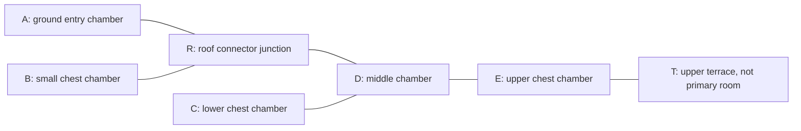
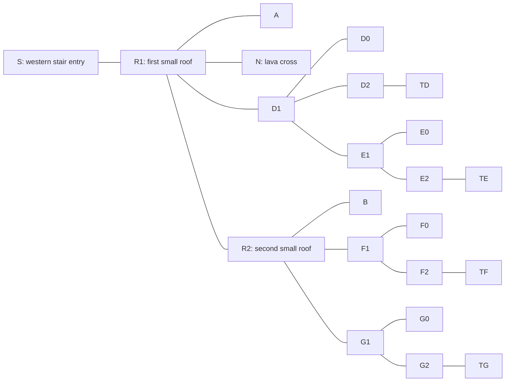

# Adorabuild modular Nether fortress

Status: local two-assembly assessment complete; Item13 remains IN PROGRESS. Do not confuse
this family with the separately assessed wart house or the courtyard family.

## Existing evidence and predeclaration

Family `adorabuild_structures:nether_fortress`, root
`adorabuild_structures:nether_fortress_large_1`, Nether. The existing
[coverage declaration](../coverage.md#adorabuild-variant-scope) requires two
procedural assemblies from distinct seed roles. The accepted candidate/start
records contain four complete padded cases: biome-diverse r1/r2 at(0,25), ordinary
r1/r2 at(-16,-7). All are SAVED with no incomplete required chunks. Their stored
piece envelopes are identical within each seed pair; this does not prove identical
blocks, loot or realized encounters. No repeated start audit or generation is needed.

Select by ascending SHA-256 of complete candidate ID, with lexical tie break,
requiring a different seed role for the second case. Execute the smaller selected
padded volume first. Do not choose by gameplay outcome. Two selected assemblies
collectively contain every one of the eight source templates; no single case
contains all eight. The fixed-layout selector's all-components-in-one-instance
condition is therefore inapplicable, not a reason to reject these valid procedural
samples or modify the fixed-layout selection contract. The direct selection below
uses the existing bound candidate/start records and hash rule, with no new selector
module or general sampling framework.

Smallest deliverable: two complete saved layouts, coordinate room/activity
boundaries and validated connectors, graph branching/depth and floor progression,
complete conditional traversal/combat tasks, source/encounter distinctions,
hazards/chokepoints, empty/dead denominators, loot/finale, engineering bypass/
external-access limits, and supported replay/large-but-shallow assessment. Apply
the Item13 room/hazard/dead/finale definitions before scoring. Template dimensions
or tower counts do not establish playable room count or depth.

Eight source templates are each5x23x5: bridge_1,dummy_bridge,stairs_1,tower_large_1,
tower_medium_1,tower_medium_2,tower_small_1,tower_small_2. Existing Item8 template
content reports no authored entities or spawner blocks in any of them. Loot-table
references occur in tower_medium_1 (one),tower_medium_2 (two),tower_small_2 (one),
all minecraft:chests/nether_bridge. These are authored references, not observed
container count, generated items or acquired loot. Check root spawn overrides and
actual saved blocks before attributing encounters or reward distribution.

Resource declaration:32,364 ordinary-case padded cells and54,694 biome-diverse
cells,87,058 total. Only the smaller selected case may be extracted before its
representative end-to-end assessment. Bound each read at120 seconds and20 MiB
compressed output, with5 GiB free floor. Reuse measure.extract, accepted archive/
backup binding, full restored inventory verification before/after and the POSIX
lock. No server is started or frozen configuration altered. Existing comparable
Basalt reads took5.53..10.15 seconds, but this is not an assumed execution time.
Retain missing-chunk, identity, geometry or budget failures instead of substituting
another case. Inspect the block sheet before declaring actor route/objectives and
complete-task budgets; no timing score is authorized by template counts alone.

## Selection and source integration

[Selection](../nether-fortress-selection.json) SHA-256
`b5719edf1aa40b47a57aac05cd99fd1a94562f55757f864ac8b31919b51b7142`
chooses ordinary r2 first, then biome-diverse r1. Reproduce from the committed
immutable inputs with the output absent:

```sh
uv run python - <<'PY'
import gzip,hashlib,json
from pathlib import Path
from tools.analyze_route_opportunities import read_bound
paths={'candidates':Path('evidence/item-13/candidates.json'),'assemblies':Path('evidence/item-13/start-inspection/summary.json'),'pool_traces':Path('evidence/item-8/sources/pool-traces-content.json.gz')}
raw={k:read_bound(p) for k,p in paths.items()}
root='adorabuild_structures:nether_fortress_large_1'
candidates={r['id']:r for r in json.loads(raw['candidates'])['candidates'] if r['root']==root}
groups=json.loads(raw['assemblies'])['family_root_dimension_candidates']
options=[r for key,rs in groups.items() if key.split('|')[1]==root for r in rs]
assert len(options)==4 and all(r['start_status']=='SAVED' and not r['incomplete_chunks'] for r in options)
chosen=[]
for r in sorted(options,key=lambda r:(hashlib.sha256(r['id'].encode()).hexdigest(),r['id'])):
    if r['seed_role'] not in {c['seed_role'] for c in chosen}:chosen.append(r)
    if len(chosen)==2:break
expected=set(json.loads(gzip.decompress(raw['pool_traces']))['structures'][root]['templates'])
assert len(chosen)==2 and set().union(*(set(r['named_components']) for r in chosen))==expected
selected=[{**candidates[r['id']],'named_components':r['named_components']} for r in chosen]
selected.sort(key=lambda r:(r['voxel_count'],r['id']))
plan={'scope':'Two distinct-seed procedural assemblies, collective eight-component coverage; smaller representative first','input_sha256':{k:hashlib.sha256(v).hexdigest() for k,v in raw.items()},'eligible_count':4,'selected':selected,'summary':{'samples':2,'families':1,'voxels_before_block_extraction':sum(r['voxel_count'] for r in selected)}}
p=Path('evidence/item-13/nether-fortress-selection.json');assert not p.exists()
p.write_text(json.dumps(plan,indent=2)+'\n')
print(hashlib.sha256(p.read_bytes()).hexdigest())
PY
```

The pinned Adorabuild JAR's
`data/adorabuild_structures/worldgen/structure/nether_fortress_large_1.json`,
SHA-256 `7642d69462eff10ab8da44ab515aa905ba56ed95c04ab4ce80b598b504fdcc6c`,
is a vanilla jigsaw root with start_pool nether_fortress/centers,size6,max distance100,
absolute start_height32 and beard_box terrain adaptation. These are generation
parameters, not playable depth. The monster override uses piece bounding boxes
and five types: blaze(weight10,group2..3),zombified piglin(5,4),wither skeleton
(8,5),skeleton(2,5),magma cube(3,4). This is renewable natural-spawn potential,
not authored residents, spawners, actual enemies or realized group sizes. Do not
copy Basalt's source-disable clock to a family with this different mechanism.

## First saved-block extraction

The following bounded command reuses the accepted extractor. Timing/resource
fields describe this read, not player traversal. Its output is a raw observation
retained losslessly with input and backup identities.

```sh
timeout 120 uv run python - <<'PY'
import gzip,hashlib,importlib,json,resource,shutil,time
from pathlib import Path
from tools.analyze_route_opportunities import read_bound
m=importlib.import_module('evidence.item-13.measure')
sha='b5719edf1aa40b47a57aac05cd99fd1a94562f55757f864ac8b31919b51b7142'
plan=json.loads(read_bound(Path('evidence/item-13/nether-fortress-selection.json'),sha))
selected=plan['selected'][0]
rows=json.loads(read_bound(Path('evidence/item-13/candidates.json'),plan['input_sha256']['candidates']))['candidates']
case,=[r for r in rows if r['id']==selected['id']]
assert case['bounds']==selected['bounds'] and case['voxel_count']==32364
output=Path('evidence/item-13/fixed-blocks/adorabuild-nether-fortress-ordinary-r2.json.gz')
assert not output.exists() and not output.is_symlink() and shutil.disk_usage('.').free>=5*1024**3
started=time.monotonic()
result={'selection_sha256':sha,'cases':[m.extract(case,voxel_budget=32364)]}
result['elapsed_seconds']=round(time.monotonic()-started,6)
result['peak_rss_kib']=resource.getrusage(resource.RUSAGE_SELF).ru_maxrss
raw=gzip.compress((json.dumps(result,sort_keys=True,separators=(',',':'))+'\n').encode(),mtime=0)
assert len(raw)<=20*1024**2
with output.open('xb') as stream:stream.write(raw)
print(len(raw),hashlib.sha256(raw).hexdigest(),result['elapsed_seconds'],result['peak_rss_kib'])
PY
```

First extraction PASS:32,364 cells,6,992 compressed bytes,4.984122 seconds and
43,588 KiB peak RSS. Raw SHA-256 is
`f4f27779a3d28a151c963a9e3c84f5ca1ae6373cad044d6b922f410018fcb0bd`.
The [saved blocks](adorabuild-nether-fortress-ordinary-r2.json.gz) retain exact
start NBT and all pre/post-verified accepted-world identities. The full23-layer
[PNG](adorabuild-nether-fortress-ordinary-r2-slices.png) was inspected; its cells are
block categories, not collision shapes or a player-view render. SVG/PNG sizes
are4,741,569/112,435 bytes. The SVG is a reproducible rendering intermediate,
kept locally under evidence/raw/item13/fortress-render/ordinary-r2-slices.svg.
Retained blocks, the renderer and inspected PNG supply the complete reviewable
evidence without another multi-megabyte copy of block tooltips. Commands executed
before moving that intermediate:

```sh
uv run python -m evidence.item-13.render_pilot --input evidence/item-13/fixed-blocks/adorabuild-nether-fortress-ordinary-r2.json.gz --output evidence/item-13/fixed-blocks/adorabuild-nether-fortress-ordinary-r2-slices.svg
timeout 120 convert -background white evidence/item-13/fixed-blocks/adorabuild-nether-fortress-ordinary-r2-slices.svg evidence/item-13/fixed-blocks/adorabuild-nether-fortress-ordinary-r2-slices.png
```

## First saved/source facts before topology scoring

There are12 saved assembly pieces: four tower components,three bridge_1 components
and five dummy_bridge components. This is not a12-room result. Every component
has bottomY31 and bounding topY53 even when most upper cells are air. Actual tower
centers are large(-254,-110),medium_2(-264,-110),small_1(-254,-120),small_2(-254,-130).
The first/last tower templates are not interchangeable simply because their boxes
match. The selected second assembly retains the other medium/small alternatives.

Saved chest blocks are exactly(-264,33,-109),(-264,41,-109),(-253,33,-130), all
single chests with minecraft:chests/nether_bridge and explicit LootTableSeed.
No saved Items arrays or spawners are present in the extraction. These are three
saved chest/table assignments, not three realized loot inventories or encounters.
They agree spatially with the two medium_2 references and one small_2 reference.

The large tower's source template SHA-256 is
`4b5ab504f748dbc6d64aeb97d58d14246d00748425117a8f4f0050bbfcb43810`.
It authors106 lava blocks. In the saved tower, the3x3 interior atY33..35 and49..51
is lava; these volumes cannot be counted as player rooms. Four interior lava
columns flank the central cross fromY37 through47. AtY36 and48 four holes expose
those columns beside the full-block cross. This requires actual collision/route
validation rather than counting the23-block box as vertical dungeon progression.
The top cap is not automatically a finale or playable activity room.

Small towers have grounded interiors beginning aboveY32 and staggered top slabs
atY33/34/35 beneath dedicated holes in theirY36 roof. Medium_2 repeats a slab
strip across itsY32/36/40/44 floor levels. These are candidate climbs, not accepted
traversal links until the complete actor sweep and landing support pass. The
bridge center floors are nether_bricks atY36, with air atY37/38. Dummy-bridge
centers are air at those heights, so they do not supply equivalent routes.

WORLD_SURFACE at all four tower centers is127. This is Nether-roof height, not
an exterior entrance or continuous ground cover. Nearby ground at sampled bridge/
dummy centers is soul_soil,gravel or soul_sand atY31 with airY32; do not assume
that the surroundings are a lava sea merely because the large tower contains lava.
External-access analysis can reuse this retained ground instead of inventing a
terrain gap. The actual local approach and climb costs remain to be established.

Next resolve the declared actor/task, slab climbs, guarded cross/bridge links,
chest interaction positions, room/landing/roof distinctions and complete modeled
accounting on this representative before extracting the second assembly. No
room count, traversal total or combat result is accepted from this extraction alone.

## Representative task declaration before route calculation

Actor: one adult player, iron armor/sword, dry grounded diamond pick available,
full initial health/hunger, no buffs, flight, building or mining in this native-route
scenario. The actor knows the layout, source context and three chest positions.
Begin/end at the small_1 ground interior cell(-253.5,33,-119.5). Survey the five
candidate indoor/open-sided tower floor spaces, inspect the medium tower's upper
terrace, acquire the modeled contents of all three chests and verify the return.
Chest contents must fit the available inventory; acquisition allowances include
transfer/menu close. Generated or acquired items remain NOT MEASURED.

Primary room boundary proposal: small_1 ground,small_2 ground,medium_2 ground,
medium_2 middle open-sided chamber and medium_2 upper chamber. Each is delineated
by actual floors/walls/ceilings, with the stair strip treated as a connector.
Small-tower roofs and the medium upper terrace are separately tracked accessible
platforms; including them as outdoor activity spaces gives a three-space counting
sensitivity. The narrow lava cross is a connector, not a room. No cap or lava
cavity is automatically an activity room. Validate these links before scoring.
Shared natural spawn context does not give each otherwise empty floor a dedicated
authored encounter; report content emptiness separately from that shared pressure.

Use the three top-slab strips in their saved orientation. Five ascending flights
of four one-block rises each are declared as crouched jumps (player height1.5,
reusing the already accepted crouch capability). This gives clearance under each
first-step ceiling while preserving the native one-block jump. Descents and all
other movement are upright. Charge the actual crouched horizontal distance and
all ten crouch enter/exit inputs; do not use upright speed for those flights.
No speculative ceiling-clipped jump or flight capability is assumed.

Visit small_2 chest first, then the medium lower chest, upper chest and terrace,
then return. At the medium lower chest station(-262.5,33,-108.5), the worked
encounter has two stationary ordinary blazes at(-263.5,33,-109.5) and
(-264.5,33,-109.5), killed near then far before opening the chest. Check their
support, melee reach and sight lines. The alternative N=0 scenario is separate.
Reuse source-supported20-health/zero-armor,6-damage fully cooled sword attacks,
13 ticks per cycle and four hits per blaze. The same approved duty sensitivities
apply. No extra natural spawns, flight, pursuit, fire or healing interruptions
occur in this conditional task; any such event censors it. Natural spawn timing
and population bounds remain UNKNOWN, not a copied spawner clock.

Use the existing A/B/C movement and analyst-allowance profiles. Declare one
initial orientation,five first-space inspections,one terrace inspection,one lava
cross inspection,three chest aims,three acquisition checks,one post-combat check,
one alignment allowance per upward jump,one per horizontal heading change and
one per enemy target. Thus15+upward_jumps+heading_changes+N decisions. Inputs are
three chest opens plus ten crouch transitions; one sword selection,three container
acquisitions and terminal verification. No mining or placement term is present
because none is permitted by this route. Compute complete totals only after the
actual support/sweep and interaction checks pass.

External-access check declaration: inspect two local ground footholds independently,
not an invented full outside-to-loot route. For the small_2 chest, stand above
saved gravel(-251,31,-130) at feet32 and remove stair(-252,33,-130). For the
medium lower chest, stand above soul_sand(-264,31,-107) at feet31.875 and remove
stair(-264,33,-108). Both target stairs are saved top-half straight windows.
Validate upright standing clearance and the chest interaction ray after exactly
one removal per window. SoulSandBlock's pinned collision SHAPE is
Block.box(0,0,0,16,14,16), static offsets11..26, so do not place this actor at an
invented full-block soul-sand height. These are alternative local mining-enabled
access checks; their removals are not part of the native task or its timing.

## Representative playable topology and quality result

The [route/interaction check](../fortress_route.py) passes on the hash-bound saved
blocks. It reuses state_at and the existing overlap predicate. Route support is
only full nether bricks or the source top-slab upper surface. Stairs used as trim,
fluids and vegetation are conservatively excluded; wall/fence avoidance includes
their1.5-block upward collision extent. Single-chest inset geometry and the
previously accepted1.8 upright/1.5 crouched player dimensions are reused.
All standing positions,118 horizontal transitions,20 crouched one-block rises,
landing support, jump head clearance,three chest rays/lid spaces and the two
stipulated melee positions pass. This is GEOMETRIC MEASUREMENT of a declared
actor route, not observed player movement or enemy AI.

```sh
uv run python -m evidence.item-13.fortress_route
```

Five primary room/activity spaces are supported by actual floor/partition geometry:

| Node | Space | Interior X/Z bounds | Main feet level | Dedicated content |
| --- | --- | --- | ---: | --- |
| A |small_1 ground chamber|-255..-253 / -121..-119|33|No dedicated reward/encounter; slab access|
| B |small_2 ground chamber|-255..-253 / -131..-129|33|One chest|
| C |medium_2 ground chamber|-265..-263 / -111..-109|33|One chest|
| D |medium_2 open-sided middle chamber|-265..-263 / -111..-109|37|Connecting slab strip|
| E |medium_2 upper chamber|-265..-263 / -111..-109|41|One chest|

These bounds include internal slabs/chests; they do not assert nine unobstructed
standing cells per room. Three roof/terrace platforms are tracked separately:
small_1 and small_2 at feet37,medium_2 upper terrace at45. Treating all three as
outdoor activity spaces gives eight spaces; the primary count is five because
those roofs have no dedicated arena/objective and two serve the connecting route.
The central lava cross is a constrained connector, not a sixth room. The large
tower's lava interiors and its unlinked top cap are not rooms in this safe native
network. No count comes from the twelve piece records or their uniform boxes.

The topology needs an explicit connector junction R on the small_1 roof. Collapsing
it into ground chamber A would incorrectly imply that B-to-D traffic enters A.
R is not added to the primary room count. T below is the separately counted upper
terrace. Edges represent validated stair/bridge connections:



All five primary rooms are reachable without mining/building. Including R/T,
the typed graph has7 vertices,6 edges,one component,two degree-three junctions
R/D,four ends A/B/C/T and zero cycles. Excluding terminal terrace T gives6 vertices
and5 edges, still not six rooms. Graph depths from A are R1,B/D2,C/E3,T4.
The terrain ground, graph edges and vertical rise remain separate measures.

Shortest station distances within the union of checked transitions are18
horizontal blocks to B's chest,32 to C's chest,32 to E's chest and35 to T.
They are scoped network distances, not global optima under flight/mining or the
complete objective circuit. The complete return circuit is118 horizontal blocks,
20 of them crouched. Support-level travel is40:20 ascent and20 descent. Floors
progress33,37,33,37,33,37,41,45 and back through41/37/33. The highest floor reached
in this safe native network is45, a12-block span; the large tower's23-block
bounding height does not represent23 blocks of traversable interior progression.
The central top cap is not connected by a ladder/slab flight in this sample.

Meaningful hazard is the authored lava column arrangement bordering the central
one-block cross. The route avoids all fluid cells, but displacement off that
cross exposes the actor to lava contact. Adjacent wall columns constrain alternate
movement; this is supported hazard exposure, not an observed damage incident.
Bridge centerlines and one-block slab strips are geometric chokepoints. Repeated
one-block jumps, crouch changes and a12-block accessible height span create fall/
movement exposure; live enemy exploitation, knockback and pathfinding are NOT
MEASURED. The low-window exterior checks also demonstrate alternate access, so
these connections are not absolute progression locks.

There are no authored/saved spawners or authored residents in this sample. The
five-type piece-bounded natural override remains potential common pressure.
Realized enemy count/diversity, spawn intervals and any population ceiling are
NOT MEASURED/UNKNOWN. Under the dedicated-content definition, A/D are empty2/5
but dead0/5: both provide necessary connective/access purpose for this entry and
reward route. Including the three platforms gives content-empty5/8 and dead1/8
(the terminal medium terrace); shared natural spawning does not become a separate
authored encounter in every otherwise empty space.

Loot distribution is three saved single-chest table assignments: two at feet33,
one at41, all the same nether_bridge identifier. Graph reward depths are2,3,3.
The saved seeds do not reveal generated contents or establish equal value. No
container is on the upper terrace or central high cap. Finale NONE: there is no
supported scripted terminal encounter, unique terminal reward table or mandatory
boss room. Objective clarity is CONDITIONAL on finding the chests, distinctive
terminal challenge ABSENT, unique terminal reward linkage ABSENT, native route
integration PRESENT for the three chest chambers and external exposure PRESENT
at the two verified ground windows. Do not designate the tallest cap a finale.

Both independent ground-window bypass checks pass: supported upright foothold,
reachable outside face of the top stair before mining, then a clear chest ray
and sufficient block-interaction reach after one stair removal. This permits B's
chest access without its slab descent and C's chest access without the upper
bridge/lava-cross route. It is a concrete local vulnerability costing one window
block per chest, not a timed outside-to-completion run. Travel between those
footholds, upper-window construction and unseen external cave approach are not
measured here. The native main task includes no such removals.

Expected replay assessment: pool alternatives support generated variation in
stairs/tower heights and reward-bearing components, with the selected second
assembly needed to validate the remaining arrangements. Natural spawn context
can continue providing pressure after a visit; neither these table assignments
nor per-player loot machinery demonstrate physical dungeon reset or renewed loot
for the same player. No player enjoyment/revisit behavior is claimed. The tall
central architectural feature has mostly lava mass and one useful crossing,
with no playable interior reward progression. This is a source/geometry-supported
large-but-mechanically-shallow feature assessment, not measured human landmark
prominence. The surrounding family sample still has five spaces, three reward
nodes and genuine native slab progression; it is not merely decorative volume.

## Representative complete conditional timing

The80+N decisions are15 declared inspection/interaction allowances,20 upward-jump
alignments and45 horizontal heading changes, plus enemy targets. Inputs are13,
selections1, acquisitions3 and terminal verification1. Mining/placement remains
zero because the accepted main route needs neither. The complete formula is:

`98/u + 20/crouch_speed + 40/j + (80+N)*decision + 13*input + selection + 3*acquisition + verification + 2.6*N/duty`

| Profile | No-enemy task | Two stipulated blazes | Active combat for two |
| --- | ---: | ---: | ---: |
| A |121.433333s|127.633333s|5.2s|
| B |218.166667s|227.100000s|5.2s|
| C |368.888889s|382.288889s|5.2s|

These are MODELED RESULTS using the approved provisional allowances, not observed
human time, guaranteed completion bounds or calibrated difficulty scores. The
world's actual enemies and inventories were not simulated or acquired. Unexpected
spawns/flight, fire/healing, failed acquisition, lost footing, altered geometry or
insufficient inventory invalidates this fixed scenario; no omitted failure cost
is silently treated as zero. The natural-spawn source has no invented disablement
phase or repeated-batch ceiling.

Focused checks: the complete route/interaction command passes, ruff check and
formatting pass, basedpyright reports zero errors/warnings and git diff --check
passes. The ordinary representative now has a complete local assessment. Proceed
to the selected biome-diverse r1 layout to cover stairs_1 and tower_medium_1 and
validate its own route and quality; do not copy these first-case metrics.

## Second selected assembly extraction

The first representative local assessment above passes. Execute the already
selected biome-diverse r1 case with the same resource and identity boundaries.
This read supplies its distinct stairs_1/tower_medium_1 arrangements, not an
independent resampling of the first case.

```sh
timeout 120 uv run python - <<'PY'
import gzip,hashlib,importlib,json,resource,shutil,time
from pathlib import Path
from tools.analyze_route_opportunities import read_bound
m=importlib.import_module('evidence.item-13.measure')
sha='b5719edf1aa40b47a57aac05cd99fd1a94562f55757f864ac8b31919b51b7142'
plan=json.loads(read_bound(Path('evidence/item-13/nether-fortress-selection.json'),sha))
selected=plan['selected'][1]
rows=json.loads(read_bound(Path('evidence/item-13/candidates.json'),plan['input_sha256']['candidates']))['candidates']
case,=[r for r in rows if r['id']==selected['id']]
assert case['bounds']==selected['bounds'] and case['voxel_count']==54694
output=Path('evidence/item-13/fixed-blocks/adorabuild-nether-fortress-biome-diverse-r1.json.gz')
assert not output.exists() and not output.is_symlink() and shutil.disk_usage('.').free>=5*1024**3
started=time.monotonic()
result={'selection_sha256':sha,'cases':[m.extract(case,voxel_budget=54694)]}
result['elapsed_seconds']=round(time.monotonic()-started,6)
result['peak_rss_kib']=resource.getrusage(resource.RUSAGE_SELF).ru_maxrss
raw=gzip.compress((json.dumps(result,sort_keys=True,separators=(',',':'))+'\n').encode(),mtime=0)
assert len(raw)<=20*1024**2
with output.open('xb') as stream:stream.write(raw)
print(len(raw),hashlib.sha256(raw).hexdigest(),result['elapsed_seconds'],result['peak_rss_kib'])
PY
```

Second extraction PASS:54,694 cells,10,479 compressed bytes,10.061025 seconds,
50,164 KiB peak RSS. [Saved blocks](adorabuild-nether-fortress-biome-diverse-r1.json.gz)
SHA-256 `099575deb8e07624b33c4e8e98a5f4d8d9848eb90c8ac19cbfc7f717e15adef8`.
The extractor verified the complete accepted restored-world inventory before and
after under the existing lock. No server ran or accepted world was altered.
The full23-layer [view](adorabuild-nether-fortress-biome-diverse-r1-slices.png)
was inspected. Its149,448-byte PNG is retained; the7,926,527-byte reproducible
SVG remains a local intermediate. Commands:

```sh
uv run python -m evidence.item-13.render_pilot --input evidence/item-13/fixed-blocks/adorabuild-nether-fortress-biome-diverse-r1.json.gz --output evidence/raw/item13/fortress-render/biome-diverse-r1-slices.svg
timeout 120 convert -background white evidence/raw/item13/fortress-render/biome-diverse-r1-slices.svg evidence/item-13/fixed-blocks/adorabuild-nether-fortress-biome-diverse-r1-slices.png
```

The19 saved pieces comprise one large tower,two small_1 towers,one medium_2,
three medium_1,seven bridges,four dummy bridges and one stairs_1. This is not a
room count. Source component names, BBs and rotations remain in start_nbt.Children
of the retained extract. Large tower center(-2,398); small centers(-2,408) and
(-2,418); medium_2 center(8,408); medium_1 centers(18,408),(8,418),(-2,428);
stairs center(-12,408). All piece bounds spanY31..53.

Five saved single chest assignments use minecraft:chests/nether_bridge:
(-1,41,428),(8,33,407),(8,41,407),(8,41,417),(18,41,407).
Their block entities retain LootTableSeed and no Items. There are no saved
spawners in the extraction. This is table potential, not generated loot or
realized enemy evidence. The root's previously inspected natural override applies.

Exact state_at inspection of the retained cells identifies a material obstruction
that forbids blindly copying first-case native movement: in the medium_1 tower
at(8,418), nether_wart_block occupies(8,37,418),(8,38,418),(8,39,418),
(9,40,419) and(9,41,419), among neighboring cells. The first three obstruct the
middle center and the last two obstruct the upper slab landing. The saved top
slabs remain at(7,37,419),(8,38,419),(9,39,419). These establish interference
with the obvious strip, not proof that every alternative route is impossible.
The medium_2 chest at(8,41,407) also has nether_wart_block immediately above at
(8,42,407), requiring a lid/interaction disposition before acquisition is modeled.
Do not silently erase these generated blocks or call their traversal time zero.

The stairs_1 connector uses three rows of actual stairs atY33/34/35 and contains
lava behind theY34 stair row. It requires exact stair-shape/support inspection;
the first-case checker conservatively excludes stair blocks and cannot validate
this climb unchanged. The other medium_1 interiors retain their saved slab
flights and must be checked in their own orientation. Next predeclare the second
actor/task and any necessary narrow removals, then validate its topology, complete
conditional accounting and quality. No second-case room/timing total is accepted
yet. Reuse the retained block extraction rather than repeating this read.

## Second route predeclaration

Reuse the first actor, gear, known-layout and success/censoring conditions, with
five chest acquisitions instead of three. Start/end on the lowest west stair
center(-13.5,33,408.5); distant approach across the surrounding lava is outside
this local task. Survey every small/medium tower floor and upper terrace, the
large tower cross, and return. Use the western actual stair as the entry link,
then first small tower, large cross, eastern medium_2 and medium_1, second small
tower, southern medium_1 and final southern medium_1. Medium slab ascents remain
crouched; the first entry stair rise is also crouched beneath its upper trim.

First check the nominal route with no removed cells to expose saved interference.
It is a diagnostic rejected-route candidate, not an accepted completion model.
Then declare only actual intersecting wart-block removals needed by the selected
route and chest lid, with mining-face reach checked before each removal. Do not
remove tower masonry or surrounding terrain merely to make a route convenient.
The conditional task may include these narrow removals with explicit costs;
retain the unchanged native-route failure. Full geometry validation precedes
any second-case topology/timing score.

Straight bottom stairs have a lower half covering the cell and a higher half in
the facing direction. The centered adult overlaps that upper half by0.3 blocks.
Reuse this source-supported stair relationship from the earlier wart-house and
blackstone-temple assessments for standing support. The sweep conservatively
avoids the entire stair cell, so it cannot falsely pass by ignoring stair volume.
There is no claim that a centered full-height support footprint covers a whole
stair block. Liquids remain forbidden even when behind a step.

The first no-removal check rejects standing at(-1.5,33,409.5), where saved wart
blocks occupy feet/head cells(-2,33,409) and(-2,34,409). Preserve this rejection;
it does not mean the source-authored empty interior was traversed. A second
support inspection rejects flat walking through(-0.5,37,408.5): its supporting
Y36 cell is air. The corresponding second small-tower slot at(-2,36,419) is also
air. These are the source stair openings, not missing chunks.

Revised declared route uses four one-cell slot crossings, twice each between
columns(-2,37,408)/(0,37,408) and(-2,37,418)/(-2,37,420). Treat the actor's
ability to jump a one-cell slot as an explicit conditional capability; test
supported endpoints and a conservative1.3-block jump envelope. Do not call this
observed jumping or flat supported walking. Charge each two-horizontal-block
leap max(2/u,1/j) seconds, an analyst movement allowance using the existing
profile scales, plus its alignment decision. This includes its horizontal travel
rather than adding that distance a second time. Failed landing censors the task.

The exact candidate clearance removals are eleven wart blocks:
(-2,33,409),(-2,34,409),(8,37,418),(8,38,418),(8,39,419),
(9,40,419),(9,41,419),(9,42,418),(9,42,419),(9,44,419), and the
chest-lid obstruction(8,42,407). Check each from a reached route station before
removal, with a clear ray to a visible face and4.5-block interaction reach.
Retain every failed sequence. No other block may be removed. Clearing them is
part of this revised task, not a mutation of the accepted saved world.

Use bare-hand clearing at20TPS, no effects/submersion: the pinned Blocks static
registration offsets25112..25144 gives nether_wart_block ordinary Block,
strength1 and no correct-tool requirement. Existing Player/BlockBehaviour break
progress rules give1/(1*30) per tick,30 ticks/1.5s per block. Charge16.5s for
eleven, plus eleven targeting/input allowances. Select empty hand initially,
sword for the two stipulated blazes at the medium_2 lower station, then empty
hand for remaining clearing: three selections. Discarded clearing drops are not
an objective or claimed acquired loot. Five chest acquisitions must still fit
inventory. No container opening or combat is performed in the actual world.

For complete accounting, declare44 fixed decisions: initial orientation1,
14 primary-space inspections,6 roof/terrace inspections,large-cross inspection1,
five chest aims,five acquisition checks,post-combat check1 and eleven clearing
choices. Add actual upward transitions, four slot alignments, actual heading
changes and one target decision per stipulated enemy. Inputs are five chest
opens,eleven mining initiations and actual pose toggles. Three selections,five
acquisitions and terminal verification are separate. Mining on an ascending
flight retains the outgoing crouched pose and1.27 eye offset; it does not silently
stand for a ray without paying pose changes. Check the ordered clearing sequence
in that pose. The alternative N=0 task retains the same inspection/selection
schedule. All allowances retain their provisional modeled meaning.

External-access predeclaration: inspect one independent ground-window approach to
medium_2's lower chest. Start above saved crimson_nylium(8,31,405), feet32,
remove only top stair(8,33,406), then check the chest's north face. Use the
unmodified saved assembly, not the main task's eleven cleared cells. This is a
local outside foothold/access check, not a complete cave-approach timing run.

## Second assembly playable topology and quality

The [second route](../fortress_second_route.py) reuses the first route's saved-state,
collision and support checks. The common check was extracted as check_route so
the second case does not duplicate a sweep implementation. First-case output
remains unchanged. The second module hash-binds its own raw input and records
each permitted removal, reached station and visible target face before applying
it in memory. All eleven removals have reachable faces in that chronological
sequence. All stationary positions, transition envelopes, five chest/lid checks
and two stipulated melee positions pass. The four slot crossings are geometrically
clear under the declared jumping capability, not runtime-validated trajectories.

The [initial native failure](fortress-second-native-failure.txt) is retained.
Reproduce its blocking wart cell with the expected failing command; the successful
command applies exactly the eleven declared removals to its in-memory model:

```sh
uv run python -m evidence.item-13.fortress_second_route --native
uv run python -m evidence.item-13.fortress_second_route
uv run python -m evidence.item-13.fortress_route
```

No accepted world is edited. The native failure remains a quality finding;
a successful breached scenario does not make the original passage clear.
The abandoned flat-walk interpretation of the two slots is also rejected by their
saved air support cells. No evidence of a player successfully jumping is fabricated.

There are14 primary floor/activity spaces after the declared clearing:

| Nodes | Tower center X/Z | Interior X/Z bounds | Feet levels | Saved reward assignment |
| --- | --- | --- | --- | --- |
| A | -2/408 | -3..-1 /407..409 |33|None|
| B | -2/418 | -3..-1 /417..419 |33|None|
| D0,D1,D2 |8/408|7..9 /407..409|33,37,41|Chest at33 and41|
| E0,E1,E2 |18/408|17..19 /407..409|33,37,41|Chest at41|
| F0,F1,F2 |8/418|7..9 /417..419|33,37,41|Chest at41|
| G0,G1,G2 |-2/428|-3..-1 /427..429|33,37,41|Chest at41|

As in the first sample, bounds include internal slabs/chests and do not imply
nine clear standing cells per floor. Each medium middle floor is an open-sided
chamber. Track six platforms separately: small roofs R1/R2 at37 and four medium
terraces TD/TE/TF/TG at45. The stair entry S and large-tower cross N are connectors,
not rooms. Including all six platforms gives20 spaces, not19 piece-derived rooms.
The first small chamber and F's slab approach require the recorded clearing;
the native unmodified graph must retain those blocked links.

Accepted modified/conditional connections are explicitly typed below. The R1-D1
and R2-G1 connections include the declared slot jumps:



This typed graph has22 vertices,21 edges,one component and zero cycles. Its six
branch junctions are R1(degree5),R2/D1(degree4),E1/F1/G1(degree3). It has12
terminal vertices; terminals include entry/connectors/platforms and must not be
reported as twelve dead rooms. From S, primary room depths are A/D1 at2;
B/D0/D2/E1/F1/G1 at3; E0/E2/F0/F2/G0/G2 at4. The farthest terrace depth is5.
Depth is conditional on clearing and slot capability, not an assertion of native
unobstructed reachability. The measured return circuit has302 horizontal blocks,
57 crouched blocks,120 support-elevation travel(60 up/60 down),60 upward
transitions,119 horizontal direction changes and30 pose toggles. Accessible
floor levels33/37/41/45 span12 blocks; the uniform23-block piece height is not
a playable-depth metric.

Dedicated-content-empty rooms are A,B,D1,E0,E1,F0,F1,G0,G1:9/14. Under this
western stair entry and reward task, five ground cul-de-sacs A/B/E0/F0/G0 have
no dedicated reward, encounter or through-route purpose and are dead5/14.
The middle floors remain necessary connectors. These are entry/task-scoped
judgments; choosing a ground chamber as entry can change its dead-room disposition,
as in the first sample. They are not claims that no mob can ever spawn there.
Including all six platforms gives empty15/20 and dead9/20: four terminal empty
medium terraces add dead ends, while R1/R2 provide necessary connections.

The authored lava cross remains a meaningful displacement hazard. The western
stair has lava beneath/behind parts of its run, and the immediately external
west cells(-15,31,408),(-16,31,408) are lava: the local stair start does not prove
a safe distant approach. The one-cell roof slots, repeated crouched slab climbs
and narrow bridge centerlines create movement constraints. Wart growth physically
intersects an otherwise authored route and blocks a chest lid; this is saved
geometric interference, not an observed AI/pathfinding failure. Its eleven-block
clearing cost is part of the successful task, not free bypass or vanished terrain.

No authored residents or spawners are added by the remaining components. The
same five-type piece-bound natural spawn potential applies; realized enemies,
diversity, attack pressure and spawn timing remain NOT MEASURED. The worked
N=2 encounter places ordinary blazes at(8.5,33,408.5),(9.5,33,408.5), attacked
near then far from(7.5,33,407.5). Their support/reach rays pass. Any natural
replacement, flight, fire, pursuit/healing or changed actor position outside the
allowances censors that fixed composition rather than expanding an invented
population ceiling.

Five chest-table assignments are distributed one at feet33 and four at41,
with graph reward depths3,3,4,4,4. All use the same nether_bridge identifier;
their saved seeds do not establish identical generated contents or reward value.
No terrace or central cap has a dedicated finale reward. Finale NONE; distinctive
terminal challenge and unique terminal reward linkage ABSENT. Objective clarity
is CONDITIONAL on locating the chests. Route integration is PRESENT in the
modified scenario, with native obstruction explicitly retained. External exposure
is PRESENT: independent standing, pre-mining face and post-removal chest-ray
checks pass from(8.5,32,405.5) after one window stair removal. This bypasses the
bridge/slab circuit to the lower chest at a concrete local cost. It does not
establish a full outside approach or upper-chest bypass timing.

Expected replay assessment: the two selected seeds provide different floor/reward
arrangements (5 versus14 primary spaces,3 versus5 assigned chest tables) and
saved interference. This supports variation between generated assemblies, not
a distribution estimate, expected player enjoyment or repeat-clear reset. Natural
spawn context can renew pressure; loot-table assignment does not prove repeat
loot for one player or physical restoration. All eight source components are
represented collectively across the pair. No additional material variant is
inferred merely from uniform tower boxes.

The large tower remains a mechanically shallow architectural feature in both
samples: lava mass, one useful crossing and no playable internal reward ascent.
The whole second assembly nevertheless has14 validated/conditionally connected
spaces and four elevated reward chambers. Do not label the entire family shallow
from its one large central feature, or claim human visual prominence was measured.

## Second complete conditional model and local gate

Movement alone is237/u +57/crouch_speed +120/j +4*max(2/u,1/j), yielding
209.4/354.75/638.333333 seconds. This separates the four slot crossings from
ordinary walking and does not double-charge their eight horizontal blocks.
The complete task includes16.5s clearing,227+N decisions,46 inputs,three
selections,five acquisitions,verification and2.6*N/duty combat:

`237/u +57/crouch_speed +120/j +4*max(2/u,1/j) +16.5 +(227+N)*decision +46*input +3*selection +5*acquisition +verification +2.6*N/duty`

| Profile | No-enemy complete task | Two stipulated blazes | Active combat for two |
| --- | ---: | ---: | ---: |
| A |358.650000s|364.850000s|5.2s|
| B |636.750000s|645.683333s|5.2s|
| C |1072.333333s|1085.733333s|5.2s|

These are conditional MODELED RESULTS, not actual traversal/combat times or
probabilities of success. Geometry passes for the declared clearing/order,
container stations and jump envelope; actual jumping, mobs and acquisitions are
not simulated. Lost footing, failed acquisition, extra enemies, unexpected
interaction interception or interruption outside the allowances censors completion.
The N=0 scenario preserves the same inspection and tool-selection schedule.

Local family deliverable: both distinct-seed samples,collective eight-component
coverage,actual topology,depth,vertical progression,complete conditional tasks,
source/enemy distinctions,hazards,chokepoints,dead/empty denominators,loot/finale,
external bypass and replay/large-but-shallow assessments are now integrated.
Raw saved inputs, first failed route and executable reproduction are retained.
This closes this family's local assessment, not the Item13 exit/review/merge gate.

Focused verification: successful second route/ordered removals/interactions and
model arithmetic pass; --native reproduces the retained blocking cell. Ruff
format/check and basedpyright pass. The common-check extraction reproduces
first-case output byte for byte against pushed589da300, so the first result is
not silently changed by accommodating the second case. Reproduce that comparison:

```sh
uv run python - <<'PY'
import contextlib,io,runpy,subprocess
from pathlib import Path
path=Path('evidence/item-13/fortress_route.py').resolve()
old=subprocess.check_output(['git','show','589da300:evidence/item-13/fortress_route.py'],text=True)
a=io.StringIO();b=io.StringIO()
with contextlib.redirect_stdout(a):exec(compile(old,str(path),'exec'),{'__file__':str(path),'__name__':'__main__'})
with contextlib.redirect_stdout(b):runpy.run_module('evidence.item-13.fortress_route',run_name='__main__')
assert a.getvalue()==b.getvalue()
print('First-case output byte-identical')
PY
```

Wart-block source inspection uses the already pinned SRG JAR SHA-256
26ca9c40d7e1681190b428583c38816852218e78df3f8bdb60a59a78503aec71:

```sh
downloads/item2/temurin/extracted/jdk-21.0.12.1+1/bin/javap -c -p -classpath instances/pristine-baseline-v0/libraries/net/minecraft/server/1.21.1-20240808.144430/server-1.21.1-20240808.144430-srg.jar net.minecraft.world.level.block.Blocks > /tmp/item13-fortress-blocks.javap
```

Inspect the static initializer offsets25112..25144 cited above. This is a direct
immutable-artifact derivation, not a new runtime observation or a dependency on
the temporary javap output. Existing model-source and material reports retain
the shared mining-progress and container-opening rules.
